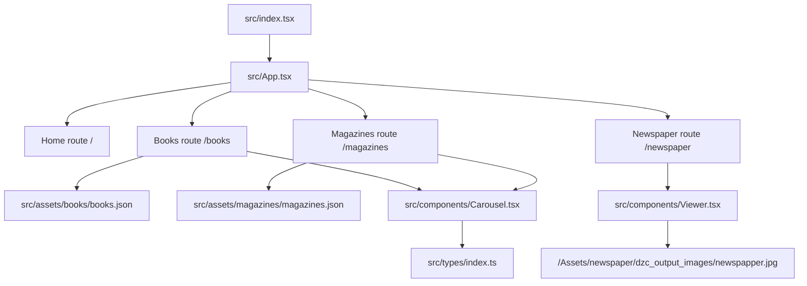

# Architecture — tera-fantastica-react

## Project Type

Static React (Vite) frontend for browsing a Bulgarian speculative fiction archive.

## Runtime Shape

- Single-page application mounted from `src/index.tsx`
- Main shell and routing live in `src/App.tsx`
- Navigation is handled with `react-router-dom`
- UI shell uses MUI components plus local CSS/SCSS files
- Content is local and asset-driven; there is no backend or live API layer in the current app

## Primary User Flows

- Home route `/` renders a branded landing page from `src/components/Layout/Home.tsx`
- `/books` maps local JSON metadata into `CarouselItem` objects and renders `src/components/Carousel.tsx`
- `/magazines` follows the same carousel flow with magazine metadata
- `/newspaper` renders `src/components/Viewer.tsx`, which provides zoom/pan interaction over a static newspaper image

## Data Flow

1. `src/index.tsx` bootstraps React and renders `src/App.tsx`
2. `src/App.tsx` creates the application shell: app bar, drawer navigation, and route outlet
3. Route components under `src/pages/` select the correct presentation component
4. Books and magazines import local JSON from `src/assets/books/books.json` and `src/assets/magazines/magazines.json`
5. Page components normalize raw asset metadata into the shared `CarouselItem` type from `src/types/index.ts`
6. `src/components/Carousel.tsx` renders the normalized records with Swiper and conditionally shows metadata and PDF links
7. `src/components/Viewer.tsx` renders a static newspaper image and wraps it with `react-zoom-pan-pinch`

## Key Source Areas

```text
src/
  App.tsx                    # app shell, drawer, routing
  index.tsx                  # React entry point
  components/
    Carousel.tsx             # shared carousel for books and magazines
    Viewer.tsx               # zoomable newspaper viewer
    Layout/Home.tsx          # landing page
  pages/
    Books.tsx                # books data mapping -> Carousel
    Magazines.tsx            # magazines data mapping -> Carousel
    Newspaper.tsx            # viewer route wrapper
  assets/
    books/books.json         # book metadata
    magazines/magazines.json # magazine metadata
    newspaper/               # newspaper image/deep zoom assets
  styles/
    swiper.css
    viewer.css
  types/index.ts             # shared UI data types
```

## Asset Model

- Public-facing image collections also exist under `public/BooksImages`, `public/MagazineImages`, and `public/NewspaperImages`
- Source metadata and working assets live under `src/assets/`
- Several components still use absolute asset URLs rooted at `/`; this is the current pattern and should be preserved unless asset handling is refactored deliberately

## Integration Points

- `@mui/material` and icons for layout shell and typography
- `swiper` for the books/magazines carousel
- `react-zoom-pan-pinch` for newspaper zoom and pan behavior
- No authenticated APIs, database access, server routes, or environment-variable-dependent services are currently present

## Legacy / Cleanup Notes

- `src/Router.jsx` appears to be a legacy router from a pre-Vite/pre-React Router v6 version and is not the active application entry path
- Both `.tsx` and leftover `.jsx` files exist; active app flow is TypeScript-first
- The current build output target is `build/`, not Vite's default `dist/`

## Visual Overview


