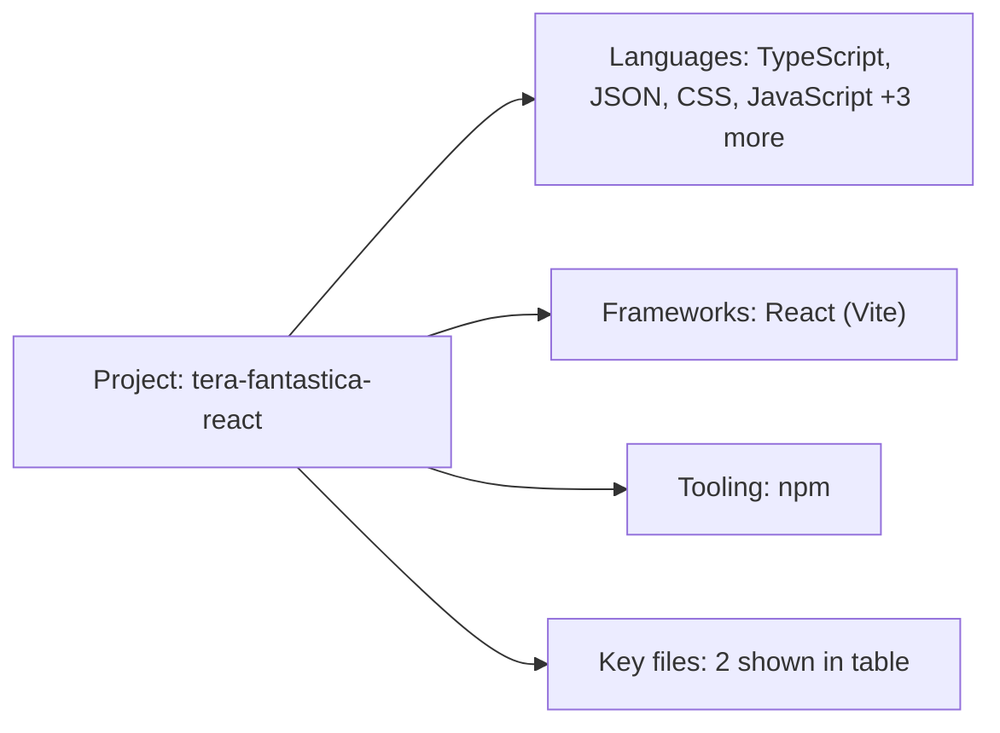

# Tech Stack — tera-fantastica-react

## Languages

- **TypeScript** — 13 files (42%) | extensions: .tsx, .ts
- **JSON** — 7 files (23%) | extensions: .json
- **CSS** — 4 files (13%) | extensions: .css
- **JavaScript** — 3 files (10%) | extensions: .jsx
- **HTML** — 2 files (6%) | extensions: .html
- **Markdown** — 1 files (3%) | extensions: .md
- **SCSS** — 1 files (3%) | extensions: .scss

## Frameworks & Libraries

- **React (Vite)** v^19.0.0 (frontend)

## Build & Tooling

- **Package Manager:** npm
- **Bundler:** Vite
- **TypeScript:** Yes
- **Docker:** No
- **Monorepo:** No

## Key Files

- `README.md`
- `package.json`

## MCP Parity Signals

- Detected language families for parity checks: TypeScript, JavaScript
- Route discovery, package/build introspection, and env-convention scanning are enabled per detected stack.

## Visual Stack Map

_Open this file in VS Code Markdown Preview to view the diagram._